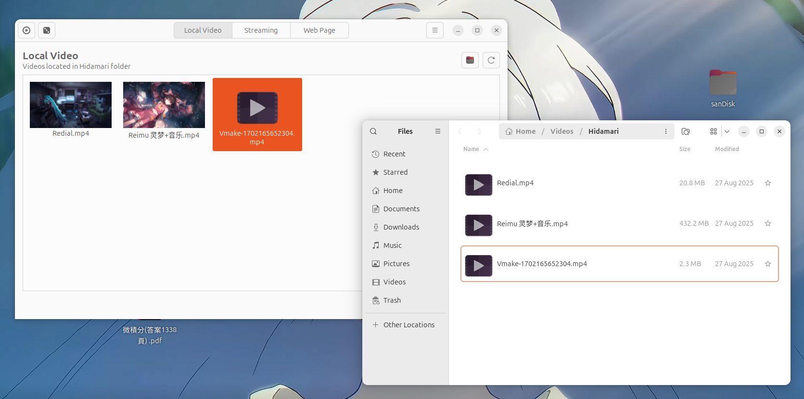
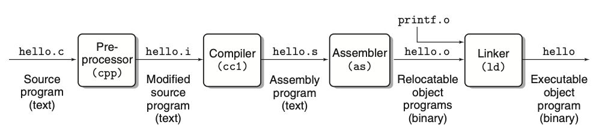

---
# try also 'default' to start simple
theme: seriph
# random image from a curated Unsplash collection by Anthony
# like them? see https://unsplash.com/collections/94734566/slidev
background: https://cover.sli.dev
# some information about your slides (markdown enabled)
title: Ubuntu release at NCHU
info: |
  ## Slidev Starter Template
  Presentation slides for developers.

  Learn more at [Sli.dev](https://sli.dev)
# apply UnoCSS classes to the current slide
class: text-center
# https://sli.dev/features/drawing
drawings:
  persist: false
# slide transition: https://sli.dev/guide/animations.html#slide-transitions
transition: slide-left
# enable Comark Syntax: https://comark.dev/syntax/markdown
comark: true
# duration of the presentation
duration: 35min

---

# Ubuntu release Party

報告人：中興應數 陳奕其 Each

<div class="abs-br m-6 text-xl">
  <button @click="$slidev.nav.openInEditor()" title="Open in Editor" class="slidev-icon-btn">
    <carbon:edit />
  </button>
  <a href="https://github.com/slidevjs/slidev" target="_blank" class="slidev-icon-btn">
    <carbon:logo-github />
  </a>
</div>

<!--
The last comment block of each slide will be treated as slide notes. It will be visible and editable in Presenter Mode along with the slide. [Read more in the docs](https://sli.dev/guide/syntax.html#notes)
-->

---
transition: fade-out
---
# 最近的我

- 中興大學興大二村 115 學年度宿舍網管
- SITCON 2026 場務組物流股長
- COSCUP 2026 場務組組長
- emfont 主要貢獻者

> email: info AT iach.cc <br>
> blog: www.iach.cc

---

# 大綱
- 簡介作業系統 & Ubuntu
- 製作開機隨身碟
- 安裝日常用軟體
  - 輸入法
  - steam
  - 快捷鍵最佳化
  - 展示黑魔法
---
title: 什麼是作業系統
transition: slide-up
layout: intro
level: 2
---

## 什麼是作業系統

作業系統是隔離使用者和硬體資源的「軟體」，負責有效的分配、存取硬體（硬碟、CPU）資源


---
transition: slide-up
layout: image-right

# Unix 家族演進
image: ./img/2026-05-10-12-08-13.png
backgroundSize: contain
---

# 作業系統的歷史
- Late 1940s：儲存程式概念（Stored-Program Concept）
  - 范紐曼架構（Von Neumann Architecture）提出
  - 程式與資料共存 → 軟/硬體正式分家
- Mid-1960s：Multics 計劃
  - Bell Labs (AT&T)、MIT、GE 合作
  - 開發大型多人多工系統 → 奠定現代 OS 基礎
- Late 1960s：UNIX 誕生
  - Bell Labs 退出 Multics 計劃
  - 研究員 Ken Thompson 開發出小型系統 Unics（後更名為 UNIX）
  - 此時 UNIX 是使用 Assembly 撰寫

---
transition: slide-up
layout: image-right

# Unix 家族演進
image: ./img/2026-05-10-12-08-13.png
backgroundSize: contain
---

# 作業系統的歷史

- Early 1970s：C 誕生與普及
  - Ken 開發 B 語言 → 效能不佳 → 失敗
    - Dennis Ritchie 基於 B 語言開發出 C 語言
    - UNIX 使用 C 語言重構 → 獲得 Portability
    - AT&T 受反壟斷法限制 → 低價授權學術界使用 UNIX
- Late 1970s：Berkeley Software Distribution, BSD 誕生
  - UC Berkeley 獲得 UNIX 原始碼 → 大幅改進 UNIX → 發行 BSD
  - BSD 成為學術界主流使用與研究對象

---
transition: slide-up
layout: image-right

# Unix 家族演進
image: ./img/2026-05-10-12-08-13.png
backgroundSize: contain
---

# 作業系統的歷史
- Early 1980s：AT&T 拆分與 UNIX 授權金暴增
  - AT&T 拆分 → 不受反壟斷法約束 → 將 UNIX（System V）商業化 → 收費閉源
  - BSD 基於 UNIX → 執行 BSD 需支付高額授權
- Mid-1980s：GNU 計劃誕生
  - UNIX 收費閉源 → Richard Stallman 發起 GNU's Not Unix, GNU 計劃
  - 建立完全自由、與 UNIX 兼容的作業系統 → 直到 1980s 末已經完成各種工具 → 缺乏 Kernel

---
layout: image-right

# Unix 家族演進
image: ./img/2026-05-10-12-08-13.png
backgroundSize: contain
---

# 作業系統的歷史

- Early 1990s：Linux 橫空出世與開源崛起
  - Linux Torvalds 發布開源核心 Linux + 採用 GNU 的授權與工具  + BSD 與 AT&T 正在打官司 → Linux 迅速成為全球開發者協作的首選
- Linux 採用 GNU 的授權與工具 → 奠定現代開源商業與開發模式 
- 1983 微軟推出第一款視窗系統

---
lauyout: center
---

# What is [Ubuntu](https://ubuntu.com)?

開源、穩定、適合日常與開發的 Linux 發行版

- 開源 Linux 作業系統
- 可用於桌機、筆電、伺服器與雲端
- 開箱即用
- 有穩定的更新週期
- 社群資源多
  - [askUbuntu](https://askubuntu.com)、[Ubuntu 台灣](https://www.facebook.com/ubuntu.tw/)
<div class="text-sm opacity-60 mt-8">
比較對象是其他 Linux 發行版
</div>


<style>
h1 {
  background-color: #2B90B6;
  background-image: linear-gradient(45deg, #4EC5D4 10%, #146b8c 20%);
  background-size: 100%;
  -webkit-background-clip: text;
  -moz-background-clip: text;
  -webkit-text-fill-color: transparent;
  -moz-text-fill-color: transparent;
}
</style>

---

# 如何開始 Linux?
- X 記下所有指令
- Ｏ 直接安裝，把電腦打扮成可愛小男娘

---
layout: two-cols-header
---

# Graphical User Interface, GUI
- 點點按按
::left::


::right::


<style>
.two-cols-header {
  column-gap: 20px;
}
</style>
---
layout: two-cols-header
---

## Graphical User Interface, GUI on Linux
::left::
::right::


---

# Linux 常見的桌面環境
- GNONE
- KDE
- xfce
- i3
- hyperland
---

# 我接觸 Linux 的經驗
1. 學長準備遠端伺服器讓我玩
2. 為了考證照，第一次使用 Ubuntu 桌面版=>背了一些好長的指令好痛苦啊啊啊
3. 使用特殊的發行版 kail 練習資安攻擊手法
4. 把家裡常用的裝置作業系統都換成 Linux
5. 放假裝了各種發行版，在家搞 homelab

---

# 如何安裝各種軟體

- APT：官方套件管理工具
- DEB：Debian / Ubuntu 安裝檔
- Snap：Ubuntu 官方推廣的跨版本套件
- AppImage：免安裝可執行檔
- flatpak
- BIN / SH：手動執行安裝程式
- 原始碼編譯：進階使用者方式


|                                                     |                             |
| --------------------------------------------------- | --------------------------- |
| <kbd>right</kbd> / <kbd>space</kbd>                 | next animation or slide     |
| <kbd>left</kbd>  / <kbd>shift</kbd><kbd>space</kbd> | previous animation or slide |
| <kbd>up</kbd>                                       | previous slide              |
| <kbd>down</kbd>                                     | next slide                  |

<!-- https://sli.dev/guide/animations.html#click-animation -->

<p v-after class="absolute bottom-23 left-45 opacity-30 transform -rotate-10">Here!</p>

---

## [flatpak](https://flatpak.org/setup/)

```bash
sudo apt install flatpak
sudo apt install gnome-software-plugin-flatpak
flatpak remote-add --if-not-exists flathub https://dl.flathub.org/repo/flathub.flatpakrepo
```

---
image: ./img/miku.webp
layout: image-right
backgroundSize: contain
---

## 來安裝酷酷的動態桌布！

- 使用 [Hidamari](https://github.com/jeffshee/hidamari)
- 文件建議 flatpak 用執行，flatpak 你在上一張投影片裝好了
```
flatpak install flathub io.github.jeffshee.Hidamari
# 設定開機自啟動
mkdir -p ~/.config/autostart

cat > ~/.config/autostart/hidamari.desktop <<'EOF'
[Desktop Entry]
Type=Application
Name=Hidamari
Comment=Start Hidamari video wallpaper
Exec=flatpak run io.github.jeffshee.Hidamari -b
Terminal=false
X-GNOME-Autostart-enabled=true
EOF

```
---

- 把影片預先放在 `~/Videos/Hidamari`  就可以選中播放，也可以設定隨機輪播
- 


---

# 輸入法
我都用[小麥注音](https://github.com/openvanilla/fcitx5-mcbopomofo)

- 需要自己編譯，參考[官方文件](https://github.com/openvanilla/fcitx5-mcbopomofo/blob/master/README.md#%E5%AE%89%E8%A3%9D%E6%96%B9%E5%BC%8F)複製貼上
  - 別怕真的很簡單，複製貼上而已
- 不想自己編譯可以安裝新酷音
---

## 什麼是「編譯」？




---
# Setup

```bash
git clone https://github.com/openvanilla/fcitx5-mcbopomofo.git
cd fcitx5-mcbopomofo
sudo apt install \
    pkg-config fcitx5 libfcitx5core-dev libfcitx5config-dev libfcitx5utils-dev fcitx5-modules-dev \
    cmake extra-cmake-modules gettext libfmt-dev libicu-dev libjson-c-dev

cmake -B build -DCMAKE_INSTALL_PREFIX=/usr -DCMAKE_BUILD_TYPE=Release
cmake --build build
sudo cmake --install build

# 初次安裝後，執行以下指令，小麥注音 icon 就會出現在 fcitx5 選單中
sudo update-icon-caches /usr/share/icons/*
```

---

# 如何移機
- Windows
  - 備份資料，覆蓋系統碟（ C 槽）
- MacOs
  - 取決你使用的 CPU 晶片
    - M 系列晶片：[Asahi Linux](https://asahilinux.org)
    - intel :和一般筆電安裝流程一樣

---
layout: intro
---

## 演示時間

---

# 參考資料（推薦閱讀）
-  [YouTube: The Fun Way to Learn Linux](https://www.youtube.com/watch?v=zn2vJNSfSo4)
- [談flatpak 等安裝格式原理](https://forum.gamer.com.tw/C.php?bsn=60030&snA=630254)
- [受够了 MacOS，我给 Macbook 装上了 Linux](https://blog.l3zc.com/2023/11/installing-ubuntu-on-macbook/)
- [Linux on MacBook experience](https://www.youtube.com/watch?v=GiXHkRc8axM)
---

# 參考資料（看不完的那種）
- text book : UNIX The Textbook, Third Edition | By Syed Mansoor Sarwar, Robert M. Koretsky
- Computer Systems A Programmer’s Perspective THIRD EDITION : The compilation system
