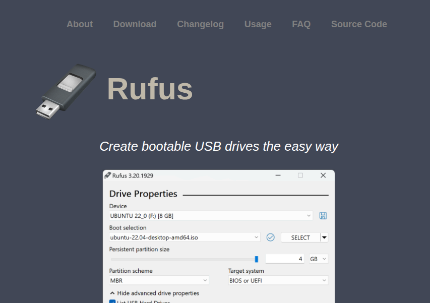
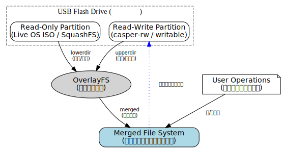
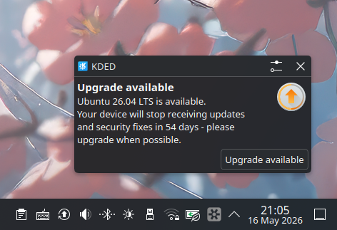
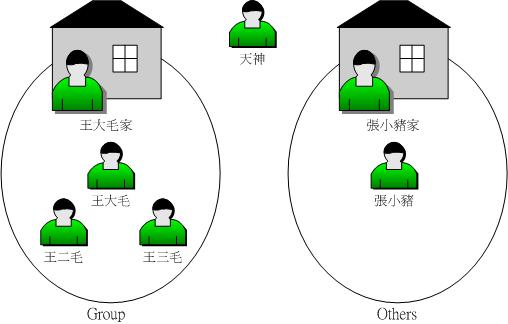
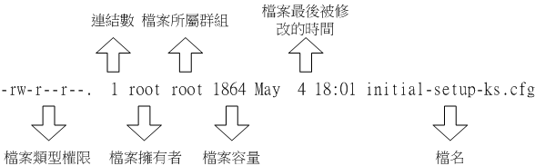
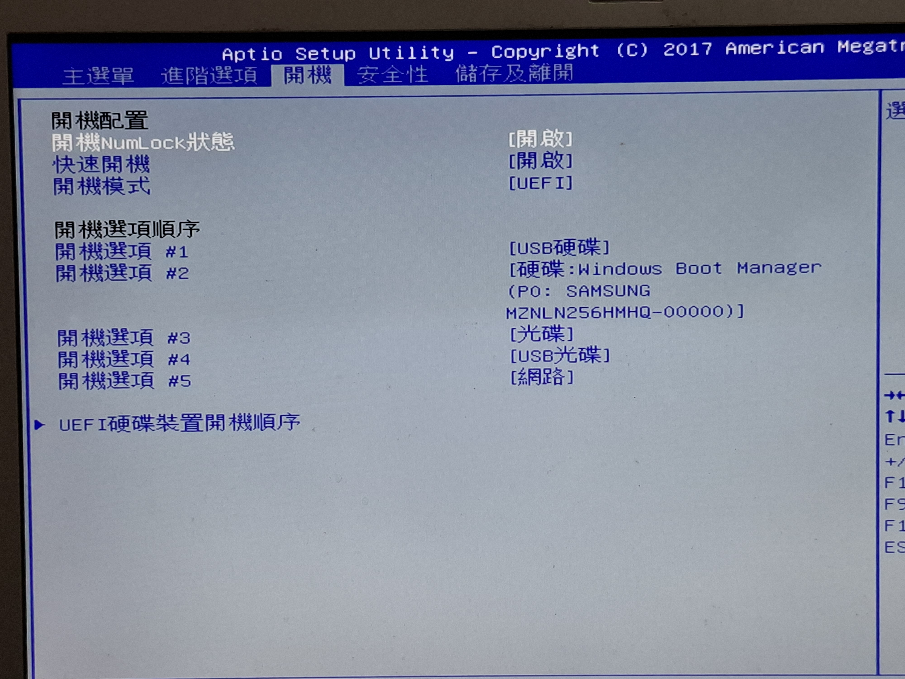

# Ubuntu Release Party

中興應數 林煒宸 Windson

---
transition: slide-left
---

# WHOAMI
- 應數二 林煒宸
- 長虹吉他社 50th 教學、51st 副社長
- 用 Linux 的一般人

> email: [info AT windson.cc](mailto:info@windson.cc) <br/>
> blog: [www.windson.cc](https://www.windson.cc)

<style>
blockquote {
  margin-top: 20px;
}
</style>
---
transition: slide-up
---
# 製作開機碟
首先要下載作業系統的 ISO 檔。今天我們要灌的是 [Ubuntu 26.04](https://releases.ubuntu.com/26.04/)，已經幫各位下載下來了。

## Linux
```bash
sudo dd if=/path/to/iso of=/path/to/device bs=4M status=progress
```

<style>
h2 {
  margin-bottom: 50px;
}
</style>
---
transition: slide-up
---
## Windows

使用 [Rufus](https://rufus.ie/en/#download)



<style>
img {
  height: 400px;
  width: 
} 
</style>

---
layout: image-right
image: ./img/rufus.png
transition: slide-up
---

## Rufus
1. 裝置：找到你的USB（他會自己找到 or 比對儲存空間大小）
2. 開機模式：ubuntu-26.04-desktop-amd64.iso
3. 資料分割配置：GPT

<style>
li {
  margin-top: 20px;
}
</style>
---
layout: cover
transition: slide-up
---
# Wait A Half Hour

---
transition: slide-up
---
# 製作持久化開機碟
<div class="persistence-usb">
<li v-click="1">
  一般的開機碟沒有儲存功能
</li>
<li v-click="2">
  持久化開機碟 -> 有儲存功能
</li>
<li v-click="3">
  帶著走的行動電腦
</li>
</div>



<style>
img {
  height: 300px;
  width: auto;
  margin-top: 15px;
}
.persistence-usb {
  li{
    margin-top: 20px;
  }

}
</style>
---
layout: cover
transition: slide-up
---
# Why use Linux ?
---
transition: slide-up
---
## 閒置時記憶體用量 (Windows)

 
<div class="memory-item">
  
  <div v-click="1">
    <span class="memory-label">67%</span>
  </div>
</div>


<style>
.memory-item {
  display: flex;
  flex-direction: column;
  align-items: center;
  gap: 8px;
  margin-top: 30px;
}

.memory-item img {
  width: 600px;
  height: auto;
  display: flex;
}

.memory-label {
  font-size: 1.2rem;
  font-family: monospace;
  font-weight: bold;
  color: #ffffff;
}
</style>
---
transition: slide-up
---

## 閒置時記憶體用量 (Linux)
<div class="memory-item">
  
  <div v-click="1">
    <span class="memory-label">16.7%</span>
  </div>
</div>
 
<style>
.memory-item {
  display: flex;
  flex-direction: column;
  align-items: center;
  gap: 8px;
  margin-top: 30px;
}

.memory-item img {
  width: 550px;
  height: auto;
  display: flex;
}

.memory-label {
font-size: 1.2rem;
  font-family: monospace;
  font-weight: bold;
  color: #ffffff;
}
</style>

---
layout: cover
transition: slide-up
---
# 記憶體佔用大會怎樣？
---
layout: image-right
image: ./img/windows-update.png
transition: slide-up
---

## 系統更新 (Windows)
- 微軟叫更新，你只能聽話
- 強迫更新之後硬體跟不上
- [KCCI-TV 氣象播報中斷事件](https://www.youtube.com/watch?v=WumCZLTpfKw)
- [2024年CrowdStrike大規模藍白畫面事件](https://zh.wikipedia.org/zh-tw/2024%E5%B9%B4CrowdStrike%E5%A4%A7%E8%A7%84%E6%A8%A1%E8%93%9D%E5%B1%8F%E4%BA%8B%E4%BB%B6)
<style>
li {
  margin-top: 25px;
}
</style>
---
transition: slide-up
---
## 系統更新 (Linux)



<style>
img {
  margin-top: 50px;
}
</style>
---
layout: cover
transition: slide-left
---
# 你的電腦不是你的電腦

---
layout: cover
transition: slide-up
---
# Let's use Linux

---
transition: slide-up
---

# Linux 小知識
## 帳號管理
<div class="account-intro">
  
  <span>
    <a herf="https://linux.vbird.org/linux_basic/centos7/0210filepermission.php">鳥哥私房菜 圖5.1.1</a>
  </span>
</div>

<style>
.account-intro {
  display: flex;
  flex-direction: column;
  align-items: center;
  gap: 8px;
  margin-top: 30px;
}
</style>

---
transition: slide-up
---
## 檔案權限

- `r` : Read （讀檔）
- `w` : Write （寫檔）
- `x`：execute（執行）

<div class="account-intro">
  
  <span>
    <a herf="https://linux.vbird.org/linux_basic/centos7/0210filepermission.php">鳥哥私房菜 圖5.1.1</a>
  </span>
</div>

<style>
li {
  margin-top: 15px;
}
.account-intro {
  display: flex;
  flex-direction: column;
  align-items: center;
  gap: 8px;
  margin-top: 50px;
}
</style>

---
layout: center 
transition: slide-up
---
# Linux 怎麼玩遊戲？


<style>
img {
  margin-top: 30px;
  height: 400px;
  width: auto;
}
</style>

---
layout: image-right
image: ./img/proton.png
transition: slide-up
---
# Steam
- [下載 .deb 檔](https://store.steampowered.com/about/)
```bash
sudo dpkg -i steam_latest.deb
```

在 Steam 中下載 Proton 後，大部分的遊戲都可以執行。如果不是 Steam 內的遊戲也可以匯入。

---
layout: cover
transition: slide-up
---
# Let's try Linux

---
layout: two-cols-header
transition: slide-up
---
::left::
# 電腦怎麼開機？
## BIOS / UEFI
- BIOS: Basic Input/Output System
- UEFI: Unified Extensible Firmware Interface
- 電腦啟動時第一個載入的軟體

> **可以在這邊設定要用哪個硬碟開機！**

- 進入 BIOS/UEFI
各廠牌進入的按鍵都不太一樣。請各位自行搜尋，已知：
  - ASUS, Acer, MSI: `F2` and `Del`
::right::

<style>
h2 {
  margin-bottom:20px;
}
img {
  margin-top: 100px;
}
blockquote {
  margin-top: 20px;
  margin-right: 20px;
  margin-bottom: 20px;
}
</style>
---
layout: center
transition: slide-up
---

<p>調整開機順序，把 USB 調到最前面，並關閉 Secure Boot</p>

<style>
p{
  margin-left: 100px;
}

img {
  height: 500px;
  width: auto;
}
</style>
---


