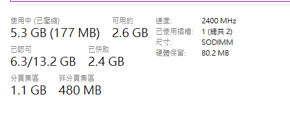

# Ubuntu Release Party

報告人：中興應數 林煒宸 Windson

---
transition: slide-left
---

# WHOAMI

- 中興大學 長虹吉他社 50th 教學、51st 副社長
- 用 Linux 的一般人

> email: info AT windson.cc  
> blog: www.windson.cc

---
transition: slide-up
---

# 比較 Windows ＆ Linux

- ## 記憶體用量

  

    
    

      12.6%
    

  

  
  

    
    

      68%
    

  

---
transition: slide-up
---

- ## 更新

  

