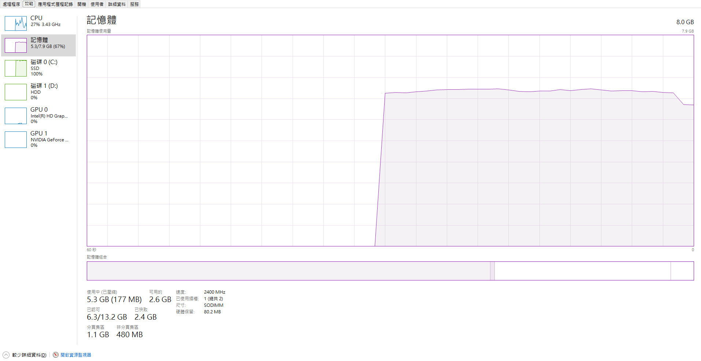
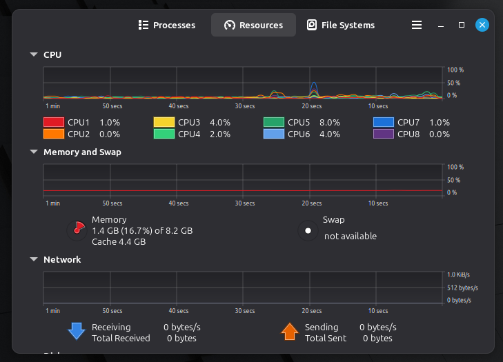
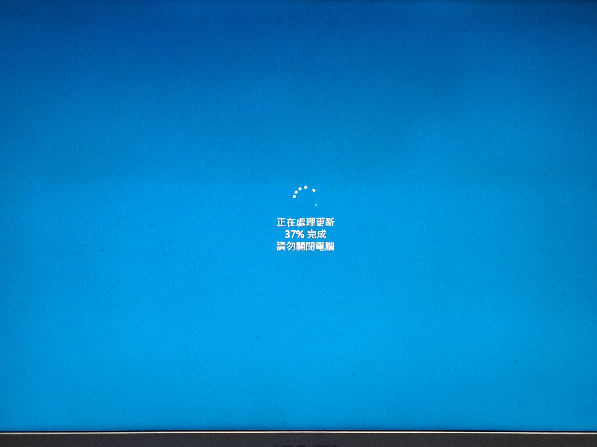
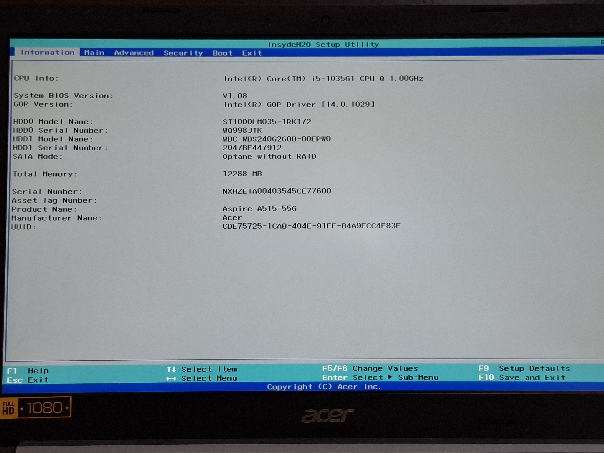
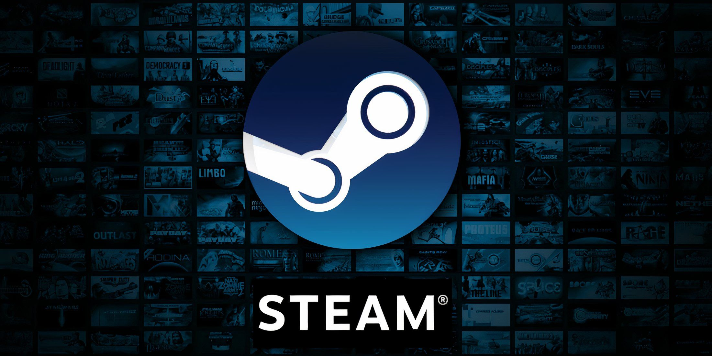
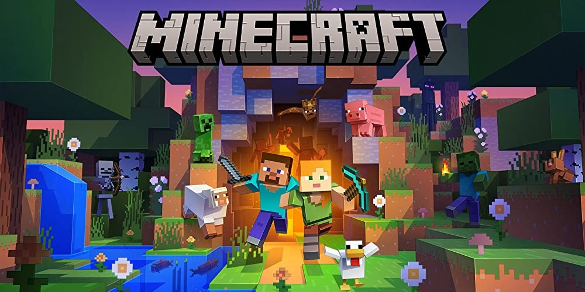

# Ubuntu Release Party

中興應數 林煒宸 Windson

---
layout: image-right
image: 
transition: slide-left
---

# WHOAMI
- 應數二 林煒宸
- 長虹吉他社 50th 教學、51st 副社長
- 用 Linux 的一般人

> email: info AT windson.cc <br>
> blog: www.windson.cc

<style>
blockquote {
  margin-top: 20px;
}
</style>
---
transition: slide-up
---

# Windows v.s Linux

## 記憶體用量

 
<div class="memory-item">
  
  <div v-click="2">
    <span class="memory-label">68%</span>
  </div>
</div>


<style>
.memory-item {
  display: flex;
  flex-direction: column;
  align-items: center;
  gap: 8px;
  margin-top: 30px;
}

.memory-item img {
  width: 600px;
  height: auto;
  display: flex;
}

.memory-label {
font-size: 1.2rem;
  font-family: monospace;
  font-weight: bold;
  color: #ffffff;
}
</style>
---
transition: slide-up
---

## 記憶體用量
<div class="memory-item">
  
  <div v-click="1">
    <span class="memory-label">12.6%</span>
  </div>
</div>
 
<style>
.memory-item {
  display: flex;
  flex-direction: column;
  align-items: center;
  gap: 8px;
  margin-top: 30px;
}

.memory-item img {
  width: 600px;
  height: auto;
  display: flex;
}

.memory-label {
font-size: 1.2rem;
  font-family: monospace;
  font-weight: bold;
  color: #ffffff;
}
</style>

---
transition: slide-left
---

- ## 更新問題
<div v-click="1">
  
</div>

<style>
img {
  margin-top: 20px;
  width: 650px;
  height: 550x;
}
</style>

---
layout: cover
transition: slide-up
---
# Let's use Linux
---
layout: two-cols-header
transition: slide-up
---
::left::
# 電腦怎麼開機？
## BIOS / UEFI
- BIOS: Basic Input/Output System
- UEFI: Unified Extensible Firmware Interface
- 電腦啟動時第一個載入的軟體

> **可以在這邊設定要用哪個硬碟開機！**

::right::

<style>
h2 {
  margin-bottom:20px;
}
img {
  margin-top: 100px;
}
blockquote {
  margin-top: 20px;
  margin-right: 20px;
}
</style>
---
transition: slide-up
---
# 製作開機碟
首先要下載作業系統的 ISO 檔。今天我們要灌的是 [Ubuntu 26.04](https://releases.ubuntu.com/26.04/)，已經幫各位下載下來了。

## Linux
- 方法一 (`dd`)
  - 一個一個區塊(bits 尺度)複製過去
```bash
sudo dd if=/path/to/iso of=/path/to/device bs=4M status=progress
```
- 方法二 (`rsync`)
  - 一個一個檔案搬過去
  - 可以改內容
  - 超麻煩，有興趣的人參考[這篇文章](https://www.windson.cc/zh/posts/live-usb-2/)

<style>
li {
  margin-top: 15px
}
</style>
---
transition: slide-up
---
## Windows

下載 [Rufus](https://rufus.ie/en/#download)


---
layout: two-cols-header
transition: slide-up
---
# Linux 怎麼玩遊戲？

::left::


::right::

 
<style>
.two-cols-header {
  column-gap: 20px;
}

img {
  margin-top: 60px;
}
</style>
